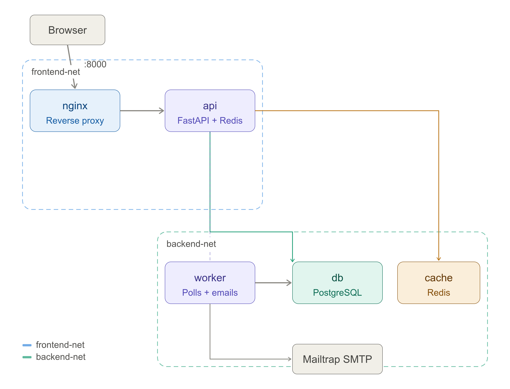

# ToDo Reminder — Containerized Multi-Service App


A production-grade containerized To-Do app with automated email reminders. Built as a DevOps portfolio project covering the full Docker ecosystem — multi-service orchestration, network segmentation, secrets management, CI/CD pipelines, and production hardening.


---

## Stack

| Layer | Technology |
|---|---|
| API | FastAPI (Python 3.12) |
| Database | PostgreSQL 16 |
| Cache | Redis 7 |
| Worker | Python background service |
| Proxy | Nginx 1.27 |
| Email | Mailtrap SMTP sandbox |
| CI/CD | GitHub Actions |
| Registry | Docker Hub |

---

## Architecture

Five services across two isolated networks:

```
Browser
   │ :8000
   ▼
[nginx] ──── frontend-net ────► [api]
                                  │
                          backend-net
                         ┌────────┼────────┐
                         ▼        ▼        ▼
                       [db]   [cache]  [worker]
                                          │
                                          ▼
                                   Mailtrap SMTP
```

- **frontend-net** — nginx and api only. Nginx is the single public entry point.
- **backend-net** — api, worker, db, cache. Database and Redis are unreachable from the host.
- **api** bridges both networks — it handles incoming HTTP and talks to the data layer.
- **worker** runs independently, polling Postgres every 60s for due reminders and sending emails via Mailtrap SMTP.

---

## Features

- Full CRUD REST API for to-dos (title, description, due date, completion status)
- Automated email reminders — worker checks every 60s and emails when a task is due within 5 minutes
- Redis caching on `GET /todos` with automatic invalidation on writes
- Persistent PostgreSQL storage — data survives container restarts
- Interactive API docs at `/docs` (Swagger UI, auto-generated by FastAPI)

---

## Quick Start

**Prerequisites:** Docker + Docker Compose

```bash
# 1. Clone the repo
git clone https://github.com/JananiUpeksha/ToDo_Reminder_Docker.git
cd ToDo_Reminder_Docker

# 2. Set up environment
cp .env.example .env
# Edit .env and fill in your Mailtrap credentials

# 3. Create secrets directory
mkdir -p secrets
echo -n "your_postgres_password" > secrets/postgres_password.txt

# 4. Start the stack
docker compose up --build

# 5. Open the API docs
open http://localhost:8000/docs
```

---

## Environment Variables

Copy `.env.example` to `.env` and fill in your values:

```env
# Postgres
POSTGRES_USER=todo_user
POSTGRES_PASSWORD=change_me
POSTGRES_DB=todo_db

# Mailtrap SMTP (get from mailtrap.io → Sandbox → SMTP Settings)
MAILTRAP_USER=your_username
MAILTRAP_PASSWORD=your_password
```

---

## API Endpoints

| Method | Endpoint | Description |
|---|---|---|
| GET | `/` | Health check |
| GET | `/todos` | List all to-dos (Redis cached) |
| POST | `/todos` | Create a to-do |
| GET | `/todos/{id}` | Get a specific to-do |
| PUT | `/todos/{id}` | Update a to-do |
| DELETE | `/todos/{id}` | Delete a to-do |
| PATCH | `/todos/{id}/complete` | Mark a to-do as complete |

Full interactive docs available at `http://localhost:8000/docs`.

---

## Production Deployment

Use the production compose override for resource limits and log rotation:

```bash
docker compose -f docker-compose.yml -f docker-compose.prod.yml up -d
```

Or use the Makefile shortcuts:

```bash
make up          # development
make prod-up     # production (detached)
make logs        # follow all logs
make stats       # live resource usage
make test        # run test suite
make prune       # clean unused Docker resources
```

Production resource limits:

| Service | Memory limit | CPU limit |
|---|---|---|
| db | 512MB | 0.5 core |
| api | 256MB | 0.5 core |
| worker | 128MB | 0.25 core |
| cache | 128MB | 0.25 core |
| nginx | 64MB | 0.25 core |

---

## CI/CD Pipeline

**CI** (every push, every branch):
1. Lint with flake8 (syntax errors + style checks)
2. Run 9 pytest unit tests (SQLite in-memory, Redis mocked)
3. Build Docker images for api and worker (verify they build cleanly)

**CD** (push to `main` only):
1. Build api and worker images
2. Push to Docker Hub with two tags: `:latest` and `:<git-sha>`

Public images:
- `jananiupeksha/todo-api`
- `jananiupeksha/todo-worker`

---

## Image Sizes

| Image | Size (compressed) |
|---|---|
| todo-api | 62.1 MB |
| todo-worker | 53.7 MB |
| todo-nginx | 21 MB |

Multi-stage builds reduced image sizes vs naive single-stage builds. Key optimizations:
- Builder stage installs dependencies, final stage copies only the installed packages
- `COPY --chown` avoids duplicating layers (a `RUN chown` would double the layer size)
- `python:3.12-slim` base — no build tools in the final image
- Non-root `appuser` in both api and worker containers

---

## Security

- **Network segmentation** — db and Redis are unreachable from the host (no `ports:` mapping). Only nginx exposes a host port.
- **Non-root containers** — api and worker run as `appuser`, not root.
- **Docker secrets** — Postgres password mounted as a file at `/run/secrets/postgres_password`, not stored in environment variables (avoids exposure via `docker inspect`).
- **No secrets in version control** — `.env` and `secrets/` are gitignored. `.env.example` documents what's needed without real values.

---

## Testing

```bash
cd api
source venv/bin/activate
python -m pytest tests/ -v
```

Tests use SQLite in-memory database and a mocked Redis client — no real Postgres or Redis needed to run the test suite.

```
test_root_endpoint          PASSED
test_create_todo            PASSED
test_list_todos_empty       PASSED
test_list_todos_after_create PASSED
test_get_todo_by_id         PASSED
test_get_todo_not_found     PASSED
test_update_todo            PASSED
test_mark_complete          PASSED
test_delete_todo            PASSED

9 passed in 0.97s
```

---

## What I Built and Learned

### Docker concepts covered
- **Multi-stage builds** — builder + slim final stage, `COPY --from=builder`
- **Layer caching** — requirements copied before app code, `--chown` vs `RUN chown` tradeoff
- **Docker Compose** — multi-service orchestration, `depends_on` with healthchecks, named volumes
- **Custom networks** — frontend/backend network isolation, service discovery by container name
- **Docker secrets** — file-mounted secrets vs environment variables, `POSTGRES_PASSWORD_FILE` pattern
- **Healthchecks** — `pg_isready` for Postgres, `redis-cli ping` for Redis, HTTP check for api
- **PYTHONUNBUFFERED** — why Python buffers stdout in containers and how to fix it

### Debugging experience
- Traced a "relation does not exist" error to `database.py` still using SQLite after the Postgres migration
- Fixed a multi-stage build that *increased* image size — caused by `RUN chown -R` duplicating the entire package layer; fixed with `COPY --chown`
- Diagnosed silent worker logs — Python's stdout buffering; fixed with `PYTHONUNBUFFERED=1`
- Fixed test import errors by moving `Base.metadata.create_all()` from module-level to a FastAPI startup event

### Possible improvements
- Replace the polling worker with a proper task queue (Celery + Redis pub/sub)
- Add per-user auth (JWT) — currently single-user, no auth layer
- Add `HEALTHCHECK` to the worker via a heartbeat file + mtime check
- Kubernetes deployment manifests as a next step after Docker Compose

---

## Project Structure

```
devops-todo-reminder/
├── api/
│   ├── app/
│   │   ├── main.py        # FastAPI app + routes + Redis caching
│   │   ├── models.py      # SQLAlchemy ORM model
│   │   ├── schemas.py     # Pydantic request/response schemas
│   │   └── database.py    # DB connection + Docker secrets support
│   ├── tests/
│   │   └── test_todos.py  # 9 unit tests (SQLite + mocked Redis)
│   ├── Dockerfile         # Multi-stage, non-root user, healthcheck
│   └── requirements.txt
├── worker/
│   ├── worker.py          # Polling loop + Mailtrap SMTP sender
│   ├── Dockerfile         # Multi-stage, non-root user
│   └── requirements.txt
├── nginx/
│   ├── nginx.conf         # Reverse proxy config
│   └── Dockerfile
├── docs/
│   └── docker-cleanup.md  # Docker operational commands reference
├── .github/workflows/
│   ├── ci.yml             # Lint + test + build on every push
│   └── cd.yml             # Push to Docker Hub on merge to main
├── docker-compose.yml
├── docker-compose.prod.yml # Resource limits, log rotation, restart:always
├── Makefile               # Convenience commands
├── .env.example
└── secrets/               # gitignored — contains postgres_password.txt
```

---

## License

MIT
